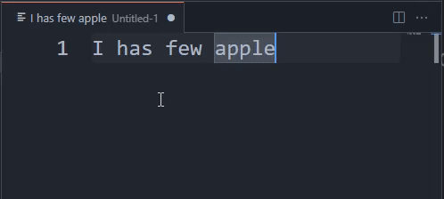

# grammar-gpt README

## Features

 - Select text and `Crtl+g f` to correct grammar issues and typos

## TODO

- [ ] use small enough language model that can be run on local, so that make this extension completely free.
- [ ] Rephrase selected text
- [ ] Next sentence suggestion

## Requirements

No requirements so far.

## Extension Settings

* `grammar-gpt.OpenAI.APIKey`: Your api key to OpenAI API

## Known Issues

 - [ ]: Doesn't show user friendly message when api key is not valid
 - [ ]: Doesn't show user friendly message when request to OpenAI fails (429, 401, etc)

## Release Notes

### 0.0.1

Initial release

### 0.0.2

 - fixed the bug that extension couldn't read api key from configuration

## Following extension guidelines

Ensure that you've read through the extensions guidelines and follow the best practices for creating your extension.

* [Extension Guidelines](https://code.visualstudio.com/api/references/extension-guidelines)
